#  Demiran Project Management Application
[](LICENSE)

This is a lightweight project management application written in PHP using MySQL/MariaDB darabase.

# Features
 - Creating Tasks in KanBan Tables and Table structure
 - Assign tasks to people
 - Connect tasks to projects
 - Manage work hours
 - Chat system
 - Plugin support: Invoice manager

# Getting started 

## System Requirements
 - PHP 7.3 or newer
 - PHP Extensions enabled: main(), ZippArchive, ImageMagick
 - MySQL 8.0 or MariaDB 10.3 and up
 - 500MB Storage
 - minimum 1280x720p screen resolution

## Getting Started

After we copied the content to a PH Webserver, open the index page where we see the install screen:

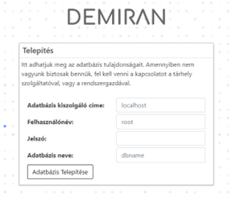 

In case if you are using **XAMPP**, the username is root, and the password is empty!

After successful install you can see the home page, where you can navigate to Login.

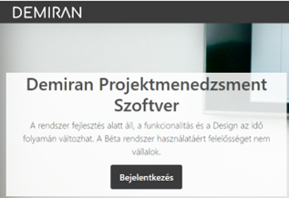 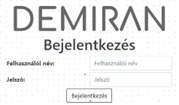 

### Default Credentials

```
username: admin
password: 1234
```
### Pages
#### Tasks
In this page you can manage the tasks, and assign then to people

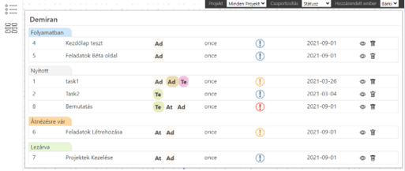 
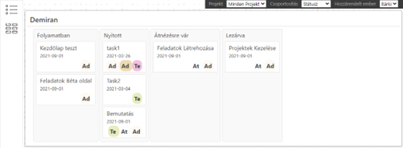 

#### Users
You can create Users, and clients in here.

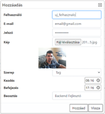 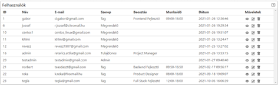

#### Projects
General Project Management page

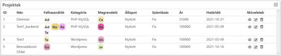 
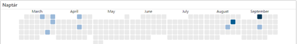 

#### Hours
We can manage workhours per individuals

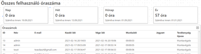 

##### Chat
Chat/Message system is a simple PHP chat, that doesn't use any polling/refresh feature,
just basic messaging functionality

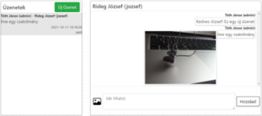

## License

This project is licensed under the BSD 3-Clause License - see the [LICENSE](LICENSE) file for details.